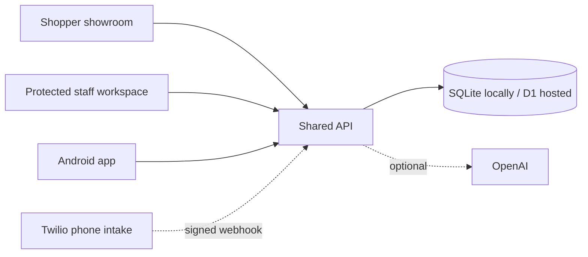

<div align="center">

# Northstar Auto
### A car showroom for shoppers. A workspace for dealership teams.

Browse vehicles, request a test drive, and follow the same request through the staff workspace — with a real database behind both.

[](https://github.com/Amartya2001-droid/car-dealership-ai-assistant/actions/workflows/checks.yml)
[](https://codespaces.new/Amartya2001-droid/car-dealership-ai-assistant?ref=master)

**[Try it](#try-it-in-your-browser)** · **[Take the demo tour](docs/TRY-IT.md)** · **[Setup & deployment](docs/APP-SETUP.md)** · **[Android release](docs/PLAY-RELEASE.md)**

</div>

## Try it in your browser

1. Click **Open in GitHub Codespaces** above and create your codespace. You need a GitHub account with Codespaces access; usage is subject to your account's allowance/billing.
2. Wait for dependency installation and the first build to finish.
3. In the terminal, run **`npm run demo`**.
4. Open the **Northstar shopper + staff app** on port **3000** from the Ports panel. Your personal demo's staff email and password appear in the terminal.

No OpenAI, Twilio, database account, or secret keys are needed. Each codespace gets its own sample database and randomly generated staff password. Keep the forwarded port private and use sample details. Stop/delete the codespace when finished.

This launches a working full-stack app in your own environment. There is no shared public production demo yet. [GitHub's port-forwarding guide](https://docs.github.com/en/codespaces/developing-in-a-codespace/forwarding-ports-in-your-codespace) explains how to open the app.

## Try it locally

Install **Node.js 22.22 or newer** and Git, then:

```bash
git clone https://github.com/Amartya2001-droid/car-dealership-ai-assistant.git
cd car-dealership-ai-assistant
npm ci
npm run demo:setup
npm run demo
```

Open **http://localhost:3000**. The terminal prints your demo staff login; retrieve it again with `npm run demo:credentials`. If port 3000 is in use, stop the other app or set the `PORT` environment variable before starting.

Demo data is saved in the ignored `.demo/` folder and survives restarts. Demo mode uses guided answers and disables external AI, phone and calendar services even if you have configured them for another local deployment. Your regular `.env` and `data/` database are not overwritten. To start fresh, stop the demo and remove only `.demo/`, then start it again.

## What you can try

| Shopper showroom | Staff workspace |
| --- | --- |
| Search/filter vehicles by body type and budget | Add and edit vehicle listings |
| Save a shortlist on your device | Review inquiries and record notes |
| View details and illustrative payment estimates | Update lead stages and export CSV |
| Ask the guided inventory assistant | Confirm, cancel or complete test drives |
| Submit an inquiry or test-drive request | Configure dealership details and currency |
| Track or delete a request using its private code | See shopper requests in the same database |

**Suggested tour:** request a Toyota test drive → save the request code → sign in to Staff → confirm the request → return to My request and see the confirmation. [Full five-minute walkthrough →](docs/TRY-IT.md)

## How it works



React web interface • Node/Express with SQLite • Worker/D1 deployment option • Capacitor Android targeting API 36.

`npm test` runs isolated backend tests. GitHub Actions builds the interface and exercises the demo's inventory, authentication, inquiry, tracking and deletion flow. The Android source is included; [build and signing instructions](docs/PLAY-RELEASE.md) explain how to connect it to your own public backend.

## Current release scope

- One dealership per deployment and one configured staff owner login.
- Four clearly labeled sample vehicles; replace these with verified inventory before launch.
- Guided assistant works immediately. Live AI and signed phone intake need your own provider accounts.
- Request codes are shown in the app; automatic confirmation emails/SMS are not implemented in the new workspace.
- No subscription billing, multiple staff accounts, multi-dealership tenancy or shopper accounts.
- Android builds have passed compilation and lint, but physical-device testing and Play submission remain to be completed. Existing test bundles need a live backend before phone workflows work.

## Explore the project

- [Run, configure and deploy](docs/APP-SETUP.md)
- [Google Play release requirements](docs/PLAY-RELEASE.md)
- [Original voice/backend documentation](docs/LEGACY-BACKEND.md)
- [Report a bug or suggest an improvement](https://github.com/Amartya2001-droid/car-dealership-ai-assistant/issues)

When reporting bugs, include the steps and expected behavior, but never passwords, request codes, API keys, or customer information.
